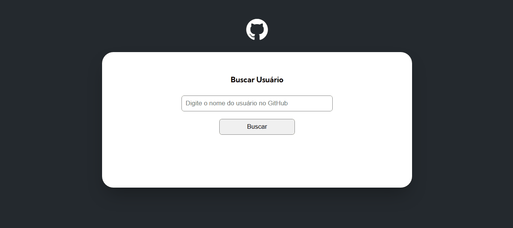
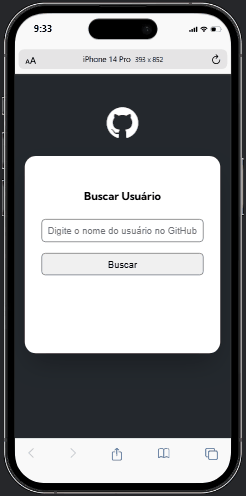

# Fetch Github API

Projeto que consome o API de usuários do Github e exibi as informações do mesmo ao pesquisar.

## API usada

https://docs.github.com/pt/rest/users/users?apiVersion=2022-11-28#get-a-user

## Tecnologias usadas 👨‍💻

- HTML 

- CSS 

- JavaScript 

- TypeScript 

## Prévia Desktop 💻



## Prévia Mobile 📱



## Funcionalidades da aplicação 💡

Logo de cara nos deparamos com um campo de busca que serve para buscar um perfil do Github com base no nickname do usuário, depois que um perfil é buscado, o site renderiza os dados do usuário como foto de perfil, bio, número de seguidores, número de pessoa que segue, 10 repositórios clipáveis que levam até o repositório no github, e por fim os 10 últimos eventos.

## Passo a passo para clonar o projeto 📝

Para clonar o projeto, você pode usar o terminal de sua preferência. O passo a passo a seguir usa os comandos do gitbash como exemplo.

1 - Abra um terminal onde deseja colocar o projeto

2 - Clone o projeto
```
git clone "url do projeto"
```
3 - Acesse a pasta do projeto
```
cd projeto-fetch-github-api
```
4 - Instale as dependências do projeto
```
npm install
```
5 - Compile os arquivos TypeScript
```
npx tsc
``` 
ou
```
tsc
```
6 - Abra no vscode
```
code .
```