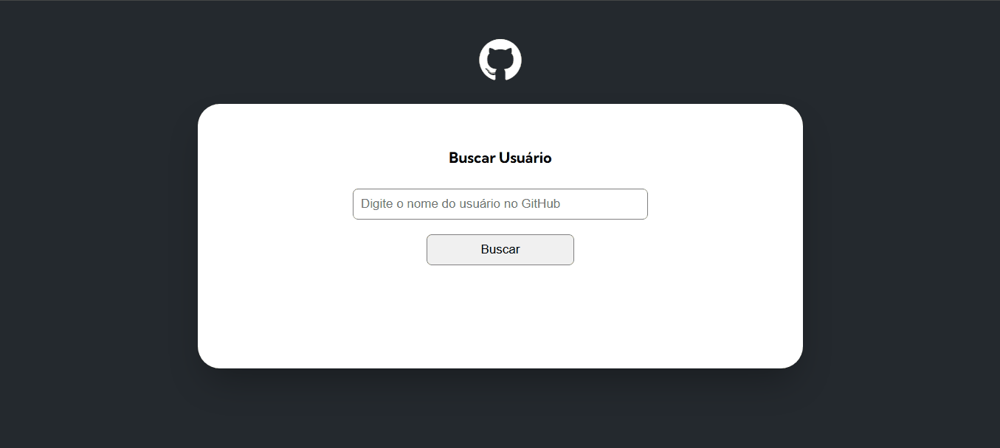

# Fetch Github API

Projeto que consome o API de usuários do Github e exibi as informações do mesmo ao pesquisar.

## Linguagens usadas

- HTML 

- CSS 

- JavaScript 

## Prévia



## Funcionalidades da aplicação

Logo de cara nos deparamos com um campo de busca que serve para buscar um perfil do Github com base no nickname do usuário, depois que um perfil é buscado, o site renderiza os dados do usuário como foto de perfil, bio, número de seguidores, número de pessoa que segue, 10 repositórios clicaveis que levão até o repositório no github, e por fim os 10 ultimos eventos.

## Passo a passo para clonar o projeto

Para clonar o projeto você pode usar o terminal de sua preferência, o passo a passo a seguir usa os comandos do gitbash como exemplo.

1 - Abra um terminal onde deseja colocar o projeto

2 - Clone o projeto
```
git clone "url do projeto"
```
3 - Entre na pasta do projeto pelo terminal
```
cd nome-da-pasta
```
4 - Abra o projeto no VScode
```
cd .
```